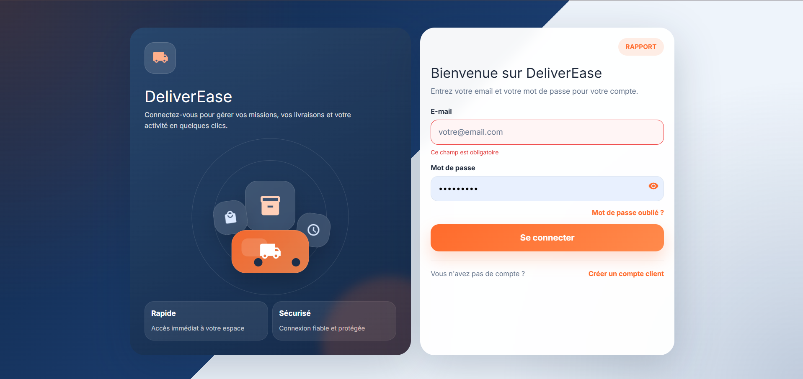
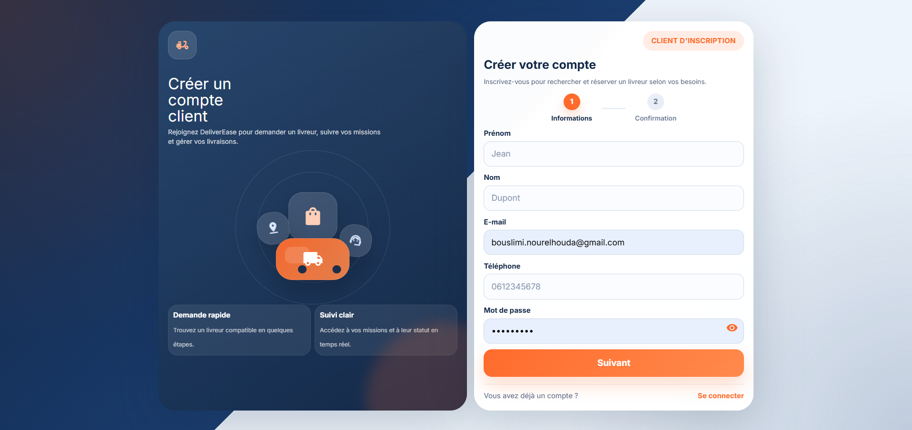
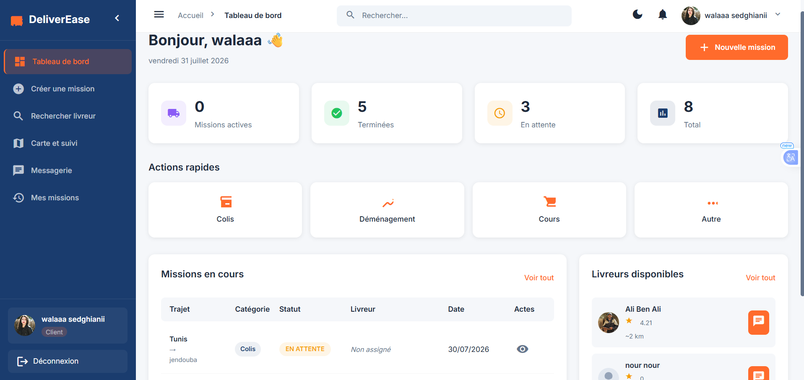
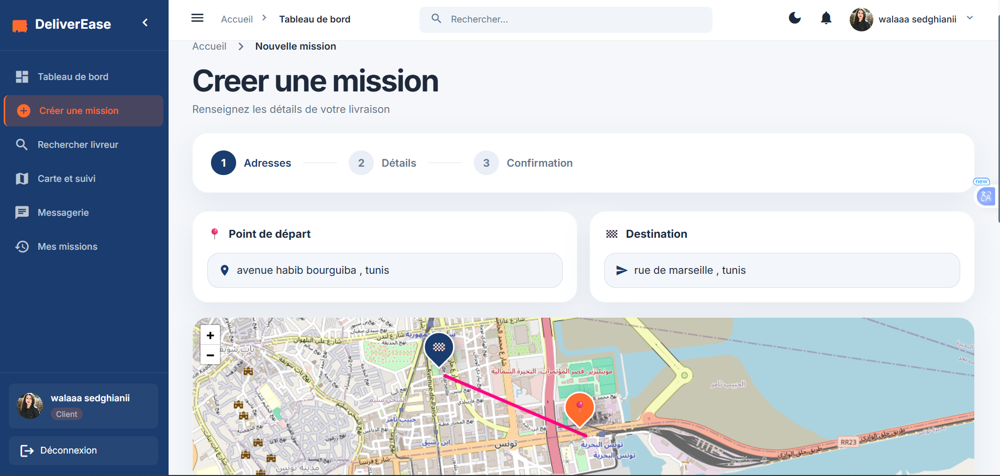
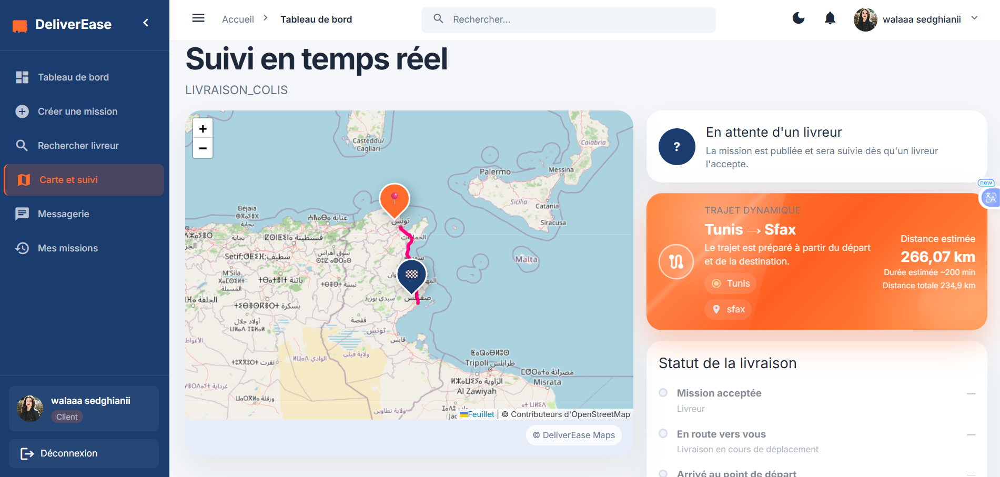
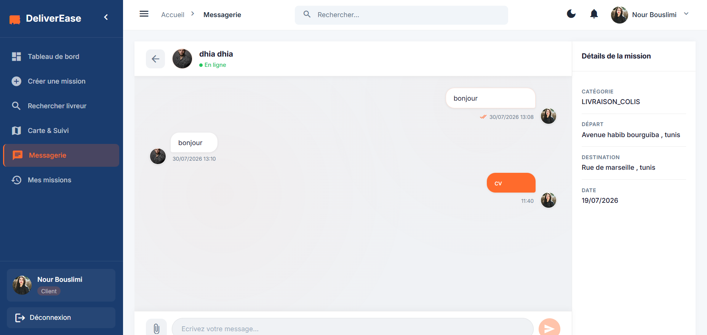
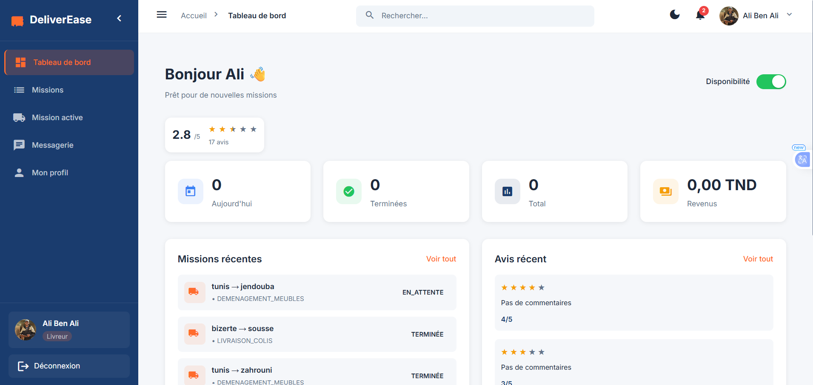
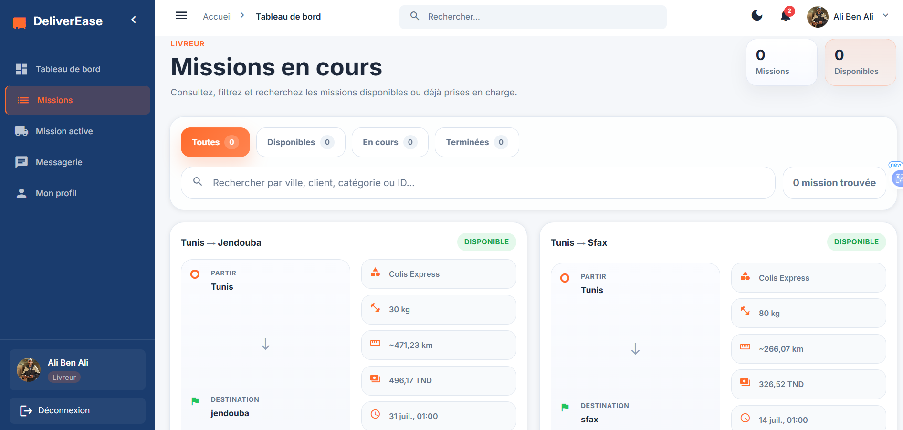
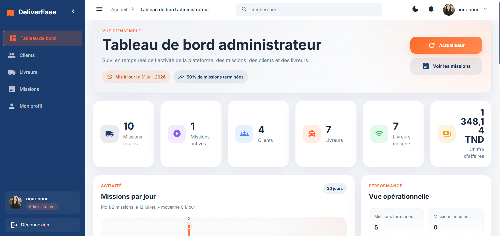
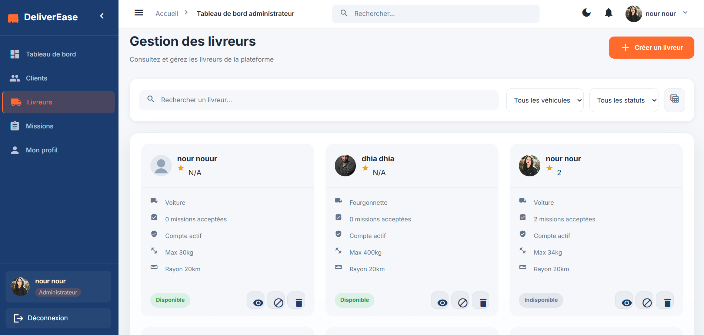

# 🚚 DeliverEase

Application web de livraison/transport à la demande, mettant en relation clients et livreurs avec suivi en temps réel, chat intégré, et un moteur de compatibilité véhicule/mission.

---

## 📸 Aperçu de l'application

### Authentification
<p align="center">
  
  
</p>

### Espace client
<p align="center">
  
  
</p>

### Suivi en temps réel & chat
<p align="center">
  
  
</p>

### Espace livreur
<p align="center">
  
  
</p>

### Espace administrateur
<p align="center">
  
  
</p>


---

## ✨ Fonctionnalités

### 🔐 Authentification & Sécurité
- Connexion / Inscription
- Réinitialisation du mot de passe (avec token de redirection)
- Intercepteur JWT pour les routes protégées
- Contrôle d'accès par rôle (client / livreur / admin)

### 👤 Espace Client
- Dashboard et profil client
- Création de mission avec estimation du prix
- Recherche de livreurs disponibles selon la compatibilité (type de véhicule, poids, volume, rayon de service)
- Suivi en temps réel d'une mission (géolocalisation live)
- Chat en temps réel avec le livreur
- Historique des missions
- Notation du livreur après la mission

### 🛵 Espace Livreur
- Dashboard et profil livreur
- Liste des missions assignées
- Vue dédiée à la mission active
- Chat en temps réel avec le client

### 🛠️ Espace Administrateur
- Dashboard avec indicateurs clés (missions, clients, livreurs, statuts)
- Gestion des clients (consultation, désactivation/réactivation)
- Gestion des livreurs (création de compte avec envoi automatique des identifiants par email)
- Gestion des missions (attribution, suivi, statuts)
- Notifications en temps réel

### 🤖 Intelligence & recommandation
- Suggestion intelligente du type de véhicule requis selon les caractéristiques du colis (via l'API Groq)
- Système de recommandation de livreur pour une mission donnée

---

## 🏗️ Stack technique

| Côté | Technologies |
|---|---|
| **Backend** | NestJS · PostgreSQL · TypeORM · Socket.IO |
| **Frontend** | Angular 18 (NgModule) |
| **Temps réel** | Socket.IO (tracking, chat, notifications) |
| **Cartographie** | Leaflet + OpenStreetMap |
| **Stockage images** | Cloudinary |
| **Emails transactionnels** | Brevo (API) |
| **IA / Suggestion** | Groq API |
| **Déploiement** | Backend → Render · Frontend → Vercel |

---

## 📂 Architecture du projet

```
stage4eme/
├── main (branche)          → Backend NestJS
│   └── src/
│       └── modules/
│           ├── auth/
│           ├── users/
│           ├── missions/
│           ├── chat/
│           ├── ratings/
│           ├── notifications/
│           ├── geolocation/
│           ├── vehicle-suggestion/
│           ├── driver-recommendation/
│           ├── admin-dashboard/
│           ├── cloudinary/
│           └── mail/
└── frontend (branche)      → Frontend Angular
    └── src/
        └── app/
            └── modules/
                ├── auth/
                ├── client/
                ├── livreur/
                ├── admin/
                └── shared/
```

---

## ⚙️ Prérequis

- Node.js ≥ 18
- PostgreSQL ≥ 14
- Un compte [Cloudinary](https://cloudinary.com) (stockage d'images)
- Un compte [Brevo](https://www.brevo.com) (envoi d'emails, avec expéditeur vérifié)
- Une clé API [Groq](https://console.groq.com) (suggestion intelligente)

---

## 🚀 Installation en local

### 1. Cloner le repo

```bash
git clone https://github.com/Nour-Bouslimi/stage4eme.git
cd stage4eme
```

### 2. Backend

```bash
git checkout main
npm install
```

Crée un fichier `.env` à la racine du backend en te basant sur `.env.example` :

```env
PORT=3000
JWT_SECRET=ton_secret

# Base de données locale
DB_HOST=localhost
DB_PORT=5432
DB_USER=postgres
DB_PASS=ton_mot_de_passe
DB_NAME=stage4eme

# Cloudinary
CLOUDINARY_CLOUD_NAME=...
CLOUDINARY_API_KEY=...
CLOUDINARY_API_SECRET=...

# Email (Brevo)
BREVO_API_KEY=xkeysib-...
EMAIL_FROM=ton_email_verifie@example.com
FRONTEND_URL=http://localhost:4200

# IA (Groq)
GROQ_API_KEY=...
```

Lance le backend :

```bash
npm run start:dev
```

Le backend démarre sur `http://localhost:3000`.

### 3. Frontend

```bash
git checkout frontend
npm install
npm start
```

Le frontend démarre sur `http://localhost:4200`.

> ⚠️ Vérifie que `src/environments/environment.ts` pointe bien vers `http://localhost:3000` pour le développement local.

---

## ☁️ Déploiement en production

### Backend → Render

1. Crée un **Web Service** sur [Render](https://render.com), connecté à la branche `main` du repo
2. Build Command : `npm install && npm run build`
3. Start Command : `npm run start:prod`
4. Ajoute toutes les variables d'environnement listées ci-dessus dans **Environment** (avec les vraies valeurs de production, notamment `FRONTEND_URL` pointant vers ton domaine Vercel)
5. Une fois déployé, note l'URL générée (ex: `https://stage4eme-backend.onrender.com`)

> 💡 Le plan gratuit Render met le service en veille après 15 min d'inactivité (cold start de 30-60s à la relance).

### Frontend → Vercel

1. Crée un projet sur [Vercel](https://vercel.com), connecté à la branche `frontend` du repo
2. Configure dans **Settings → Build and Deployment** :
   - Build Command : `npm run vercel-build`
   - Output Directory : `dist/frontendstage`
3. Vérifie que `src/environments/environment.prod.ts` pointe vers l'URL du backend Render :

```ts
export const environment = {
  production: true,
  apiUrl: 'https://stage4eme-backend.onrender.com',
  socketUrl: 'https://stage4eme-backend.onrender.com',
  mapTileUrl: 'https://{s}.tile.openstreetmap.org/{z}/{x}/{y}.png'
};
```

4. (Optionnel) Ajoute un domaine personnalisé dans **Settings → Domains**

### CORS

Dans `main.ts` du backend, autorise le domaine du frontend déployé :

```ts
app.enableCors({
  origin: [
    'http://localhost:4200',
    'https://ton-domaine.vercel.app',
    /\.vercel\.app$/
  ],
  credentials: true,
});
```

---

## 📝 Auteur

Développé par **Nour Bouslimi** dans le cadre d'un stage ingénieur.
